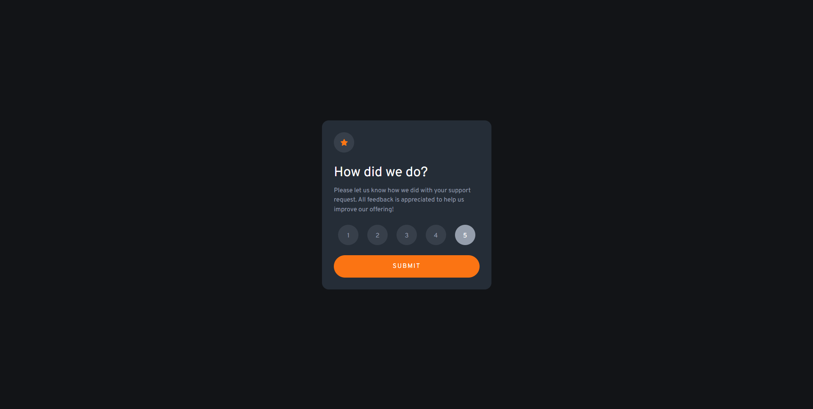
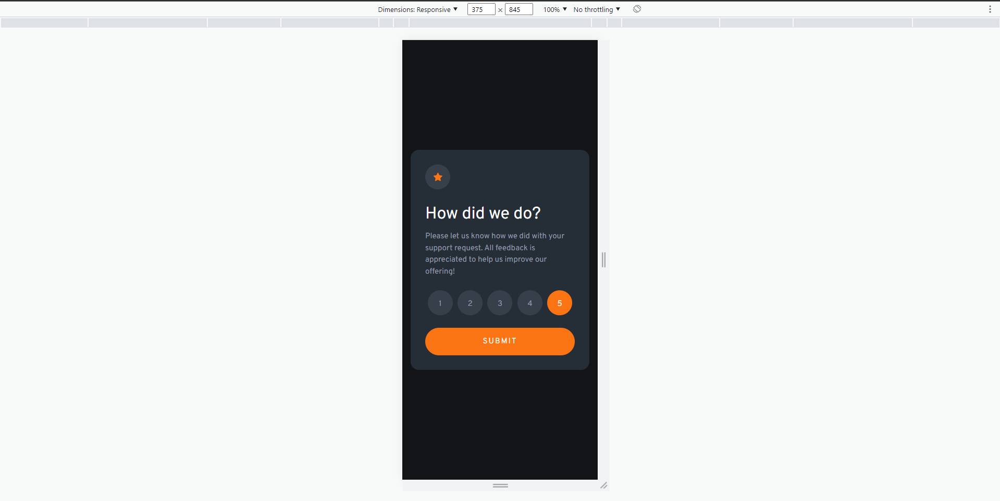
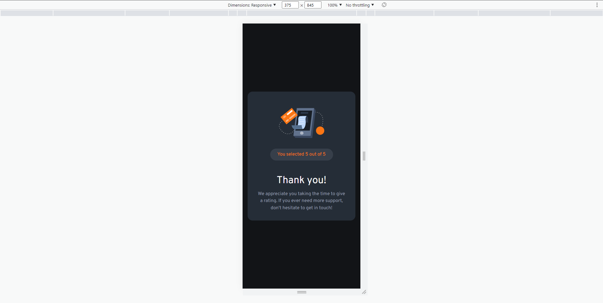

# Frontend Mentor - Interactive rating component solution

This is a solution to the [Interactive rating component challenge on Frontend Mentor](https://www.frontendmentor.io/challenges/interactive-rating-component-koxpeBUmI).

## Table of contents

- [Overview](#overview)
  - [The challenge](#the-challenge)
  - [Screenshot](#screenshot)
  - [Links](#links)
- [My process](#my-process)
  - [Built with](#built-with)

## Overview

### The challenge

Users should be able to:

- View the optimal layout depending on their device's screen size
- See hover states for all interactive elements on the page
- Select and submit a number rating
- See the "Thank you" card state after submitting a rating

### Screenshots

### Links

- Solution URL: (https://www.frontendmentor.io/solutions/interactive-rating-component-SmfPR3u4H7)
- Live Site URL: (https://primary-rating-component.netlify.app/)

## My process

### Built with

- Semantic HTML5 markup
- Mobile-first workflow
- CSS3 with using custom properties
- Vanilla JS
- Flexbox

