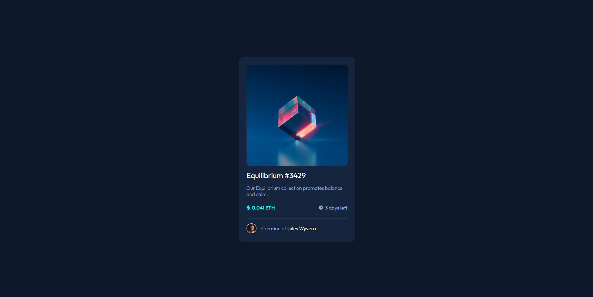
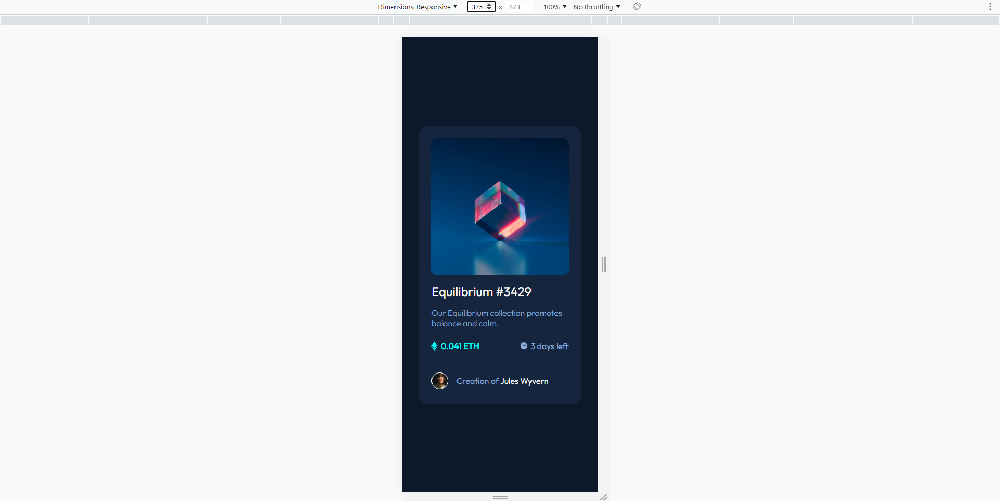

# Frontend Mentor - NFT preview card component solution

This is a solution to the [NFT preview card component challenge on Frontend Mentor](https://www.frontendmentor.io/challenges/nft-preview-card-component-SbdUL_w0U).

## Table of contents

- [Overview](#overview)
  - [The challenge](#the-challenge)
  - [Screenshot](#screenshot)
  - [Links](#links)
- [My process](#my-process)
  - [Built with](#built-with)

## Overview

### The challenge

Users should be able to:

- View the optimal layout depending on their device's screen size
- See hover states for interactive elements

### Screenshots

### Links

- Solution URL: (https://www.frontendmentor.io/solutions/nft-preview-card-component-with-basic-htmlcss-Zc3epMjTjG)
- Live Site URL: (https://fem-nft-card-component.netlify.app)

## My process

### Built with

- Semantic HTML5 markup
- Mobile-first workflow
- CSS3 with using custom properties
- Flexbox

