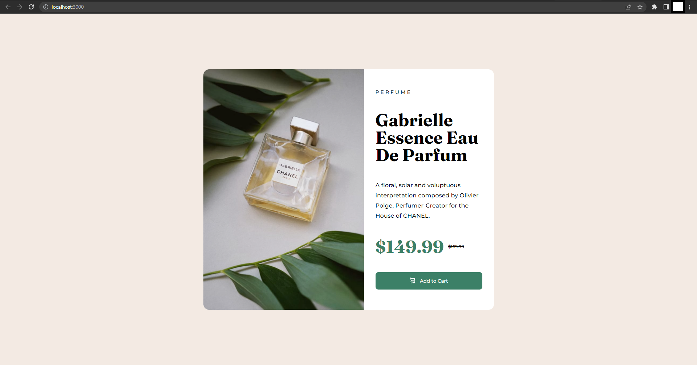
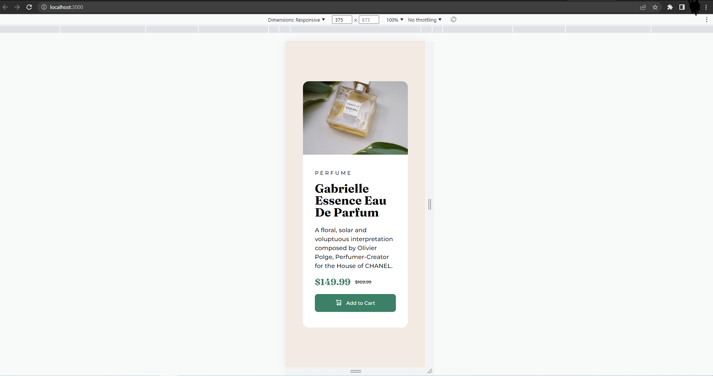

# Frontend Mentor - Product preview card component solution

This is a solution to the [Product preview card component challenge on Frontend Mentor](https://www.frontendmentor.io/challenges/product-preview-card-component-GO7UmttRfa).

## Table of contents

- [Overview](#overview)
  - [The challenge](#the-challenge)
  - [Screenshot](#screenshot)
- [My process](#my-process)
  - [Built with](#built-with)
  - [What I learned](#what-i-learned)

## Overview

### The challenge

Users should be able to:

- View the optimal layout depending on their device's screen size
- See hover and focus states for interactive elements

### Screenshots

## My process

### Built with

- Semantic HTML5 markup
- Mobile-first workflow
- Sass preprocessor(CSS custom properties, Flexbox)
- Gulp

### What I learned

For this challenge I've used Sass preprocessor and Gulp for the first time, so my code and folder organization may be messy and as a whole looks like amateur's work,
but I wanted to go beyond regular CSS stylesheets and tried to automate the whole layout process, so I've tried Sass/Gulp combination for this purpose.

Of course, I couldn't have done anything without ordinary CSS, but at the same time I've learned about variables, mixins, splitting stylesheets into modules and few other things in Sass.
Also, for this project I used Gulp for browser synchronizing with my code I wrote live, so I could see all changes made to Sass files immediately.

